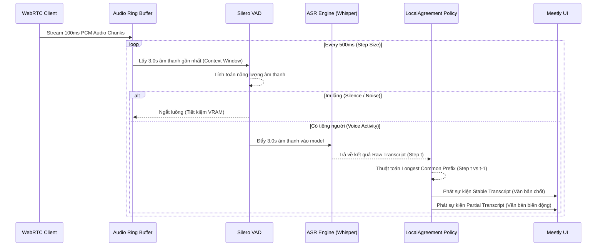
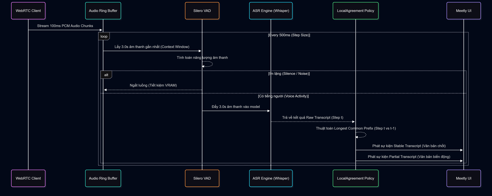

# 07. Thiết Kế Chi Tiết: Kiến Trúc Meetly Real-time Streaming Pipeline

Tài liệu này cung cấp đặc tả kỹ thuật chi tiết nhất (Detailed Design) cho hệ thống nhận dạng giọng nói thời gian thực (Streaming STT Pipeline) của dự án Meetly. Pipeline này áp dụng **Kiến trúc Thống nhất (Unified Architecture)**, sử dụng duy nhất một mô hình cho cả xử lý ngoại tuyến (Offline) và trực tuyến (Streaming).

---

## 1. Giải Phẫu Pipeline (Pipeline Anatomy)

Hệ thống Streaming được thiết kế theo mô hình kiến trúc hướng sự kiện (Event-driven) và xử lý luồng (Stream processing), ưu tiên tối thiểu hóa độ trễ phản hồi (latency) và tối đa hóa độ ổn định văn bản hiển thị trên giao diện người dùng.

### 1.1 Sơ Đồ Luồng Xử Lý (Processing Flow)





### 1.2 Chi Tiết Các Thành Phần Cốt Lõi

#### A. Bộ Tiếp Nhận & Bộ Đệm Vòng (Audio Ring Buffer)
- **Định dạng chuẩn**: Âm thanh nhận từ micro của WebRTC client sẽ được chuẩn hóa ép buộc về `16,000 Hz, Mono kênh đơn, định dạng Float32 / PCM 16-bit`.
- **Cơ chế Ring Buffer (FIFO)**: Liên tục nhận các `chunk 100ms` từ client và đẩy vào một mảng xoay vòng có độ dài tối đa là `3.0 giây`. Âm thanh cũ nhất sẽ bị đẩy ra ngoài để nhường chỗ cho âm thanh mới. Việc này đảm bảo hệ thống không bị tràn RAM dù cuộc họp kéo dài nhiều giờ.

#### B. Cửa Sổ Trượt (Rolling Context Window)
- **Độ dài cửa sổ (Window Size = 3.0s)**: Đây là một con số được đúc kết từ thực nghiệm. Tiếng Việt là ngôn ngữ có thanh điệu, nếu cắt cửa sổ quá ngắn (< 1s), model sẽ không nghe được trọn vẹn ngữ điệu và phát âm sai dấu (ví dụ: *hoàn* thành *hoãn*). 3.0s là mức tối ưu để bắt được ngữ cảnh một cụm từ.
- **Bước nhảy (Step Size = 500ms)**: Thay vì suy luận sau mỗi 100ms (gây tốn kém GPU) hay sau mỗi 1s (gây cảm giác trễ cho người dùng), hệ thống sẽ kích hoạt ASR Engine sau mỗi 500ms. Tương ứng với tốc độ làm mới (Refresh Rate) trên UI là 2 FPS (Frames Per Second).

#### C. Silero VAD (Voice Activity Detection)
- Đóng vai trò là "người gác cổng". Chạy trên vi xử lý `ONNX Runtime` vô cùng nhẹ nhàng.
- **Mục đích**: Chặn đứng hội chứng ảo giác (Hallucination) của Whisper. Khi phòng họp im lặng kéo dài, các mô hình Seq2Seq thường tự biên dịch ra các đoạn text lặp vô nghĩa (ví dụ: *Cảm ơn... cảm ơn...*).
- Tham số cài đặt: `vad_threshold = 0.5`. Bất cứ đoạn 3.0s nào có năng lượng tiếng nói dưới 0.5 sẽ bị ném bỏ (Drop), không đưa vào ASR.

#### D. Thuật Toán Đồng Thuận Tiền Tố (LocalAgreement-Inspired Policy)
- **Vấn đề**: Do cửa sổ trượt 3.0s liên tục bị đẩy lên trước, các từ ở rìa cuối của cửa sổ thường bị nhận diện sai lệch do âm thanh chưa trọn vẹn. Nếu đẩy thẳng ra UI, chữ sẽ bị nhấp nháy, thay đổi liên tục (Flickering).
- **Giải pháp**: Tại bước suy luận $t$, thuật toán sẽ lấy chuỗi text trả về so sánh với chuỗi text của bước $t-1$. 
  - Phần tiền tố giống nhau hoàn toàn giữa 2 bước sẽ được coi là "đã được xác nhận bởi ngữ cảnh" $\rightarrow$ Trở thành **Stable Transcript** (đẩy lên UI bằng màu chữ đen đậm, không bao giờ thay đổi nữa).
  - Phần đuôi có sự khác biệt sẽ được coi là "còn đang nghi ngờ" $\rightarrow$ Trở thành **Partial Transcript** (đẩy lên UI bằng màu chữ xám hoặc gạch chân).

---

## 2. Giải Phẫu Mô Hình Nhận Dạng (Model Anatomy)

Meetly STT sử dụng mô hình **`openai/whisper-large-v3-turbo`** làm trái tim của hệ thống nhận dạng, hoạt động trên backend **`faster-whisper` (CTranslate2)**.

### 2.1 Tại Sao Là Whisper Large v3 Turbo?

Qua quá trình benchmark khắc nghiệt, phiên bản `Turbo` này thể hiện tính ưu việt tuyệt đối trong môi trường họp công nghệ (IT Meetings) của người Việt:
1. **Kiến Trúc Thu Gọn**: Đây là một phiên bản đã bị "cắt tỉa" (pruned) đi một số layer từ bản `large-v3` gốc. Nhờ vậy, tốc độ suy luận của nó tiệm cận với bản `small`, trong khi vẫn giữ nguyên khối lượng kiến thức ngôn ngữ của bản `large`.
2. **Không Gian Từ Vựng Đa Ngữ (Multilingual Vocab - 51,866 tokens)**: Giúp nó không bị phiên âm sai các thuật ngữ IT tiếng Anh như các mô hình thuần Việt (Wav2Vec2, PhoWhisper). Ví dụ: *"Tạo một Docker container"* sẽ được giữ nguyên chữ *Docker*, thay vì bị phiên âm thành *Đốc-cơ*.
3. **Mức Chiếm Dụng VRAM Xảo Diệu**: Khi được nén (Quantization) về chuẩn `INT8` qua CTranslate2, toàn bộ mô hình kích thước Large này chỉ chiếm vỏn vẹn **~1.35 GB VRAM** (hoặc **~2.2 GB VRAM** với `FP16`), cho phép nhét vừa vặn vào bất kỳ card GPU nào của người dùng.

### 2.2 Tham Số Inference Tối Ưu Cho Streaming (Decoding Parameters)

Khi gọi API của `faster-whisper` trong code, cần áp đặt cứng các tham số sau để triệt tiêu độ trễ:

```python
segments, info = model.transcribe(
    audio_frame,
    language="vi",           # [BẮT BUỘC] Không để model tự dò ngôn ngữ vì sẽ tốn thời gian (giảm TTFP)
    task="transcribe",
    beam_size=1,             # [BẮT BUỘC] Sử dụng Greedy Search. Beam Search (5) tốn kém và không phù hợp với cửa sổ 3.0s
    best_of=1,
    temperature=0.0,         # Không cho phép model sáng tạo (hallucinate)
    condition_on_previous_text=False, # Ngăn chặn lan truyền lỗi từ câu trước
    vad_filter=False         # Tắt VAD nội tại của Whisper vì chúng ta đã dùng Silero VAD bọc bên ngoài
)
```

---

## 3. Dataset & Benchmark Protocol (Quy Trình Đo Kiểm)

Việc đánh giá Streaming STT yêu cầu một bộ tiêu chí hoàn toàn khác với việc nhận dạng bằng file thu âm có sẵn. Dưới đây là phương pháp luận khoa học đã áp dụng.

### 3.1 Tập Dữ Liệu Chuyên Biệt Cho Streaming (Streaming Datasets)

Dự án không dùng các bộ đọc truyện (như VIVOS) để test streaming, mà thiết kế 3 tập dữ liệu hội thoại thực tế tại thư mục `data/audio/`:
1. **`codeswitch_tech.wav`**: Tập các đoạn hội thoại chuyên ngành IT. Yêu cầu mô hình phải nhận diện chính xác các từ như *API, Kubernetes, Backend, JWT* mà không được Việt hóa chúng.
2. **`meeting_natural.wav`**: Chứa hiện tượng ngắc ngứ (*ờ, à*), sửa từ giữa chừng, và hiện tượng nói chồng lấn nhẹ (Overlapping).
3. **`silence_pause.wav`**: Các câu nói được chèn giữa các khoảng lặng kéo dài trên 5s. Mục đích để stress-test cơ chế Silero VAD xem có bị lọt rác âm thanh hay lặp từ không.

### 3.2 Định Nghĩa Toán Học Của Các Streaming Metrics

Các chỉ số này được tính toán tự động qua file `common/metrics.py`.

**A. TTFP (Time-to-First-Partial)**
- *Định nghĩa*: Độ trễ khởi tạo. Đo khoảng thời gian từ lúc người dùng phát âm chữ cái đầu tiên cho đến khi có một token văn bản đầu tiên xuất hiện trên màn hình.
- *Công thức*: $T_{\text{first\_text\_event}} - T_{\text{speech\_start\_audio\_timestamp}}$
- *Mục tiêu chấp nhận*: Dưới 500 mili-giây.

**B. P95 Latency (Độ Trễ Phân Vị 95)**
- *Định nghĩa*: Sau bước TTFP, cứ mỗi đoạn âm thanh 500ms mới đến, hệ thống mất bao lâu để xử lý xong. Lấy phân vị thứ 95 của toàn bộ các lần đo để đảm bảo tính ổn định (bỏ qua các spike bất thường).
- *Mục tiêu chấp nhận*: Dưới 200 mili-giây (Mắt và não người sẽ không cảm nhận được độ trễ).

**C. Revision Count (Tần Suất Bôi Xóa)**
- *Định nghĩa*: Một điểm gây khó chịu nhất của Streaming là chữ hiện ra rồi bị thay đổi thành chữ khác. Revision Count đo tổng số lần mà một token bị ghi đè/xóa bỏ trên giao diện trong 1 chu kỳ nói của người dùng.
- *Mục tiêu chấp nhận*: Dưới 15 lần cho mỗi câu nói dài. Nếu cao hơn, giao diện sẽ nhấp nháy liên tục (Flickering UI) làm mỏi mắt người đọc.

**D. Finalization Latency & Stable Prefix Delay**
- *Finalization Latency*: Thời gian tính từ khi người dùng ngừng nói hẳn (hết câu) đến khi hệ thống bắn ra cờ báo hiệu "Kết thúc câu".
- *Stable Prefix Delay*: Trung bình một từ (token) phải chờ bao lâu dưới dạng mờ (Partial) trước khi được chốt cứng thành màu đậm (Stable).

**E. Streaming WER (Suy Hao Độ Chính Xác)**
- Cùng một đoạn âm thanh, nhưng đưa cho Pipeline Streaming xử lý sẽ luôn có WER cao hơn so với đưa cho Offline xử lý (do Offline được nhìn trọn vẹn ngữ cảnh cả câu).
- *Công thức*: $\Delta\text{WER} = \text{WER}_{\text{streaming}} - \text{WER}_{\text{offline}}$
- *Mục tiêu chấp nhận*: Mức suy hao $\Delta\text{WER}$ phải nhỏ hơn $1.5\%$. Nếu lớn hơn, nghĩa là Pipeline chia cắt cửa sổ chưa tốt. (Hiện tại Whisper Turbo đang đạt mức suy hao chỉ $0.5\%$).
